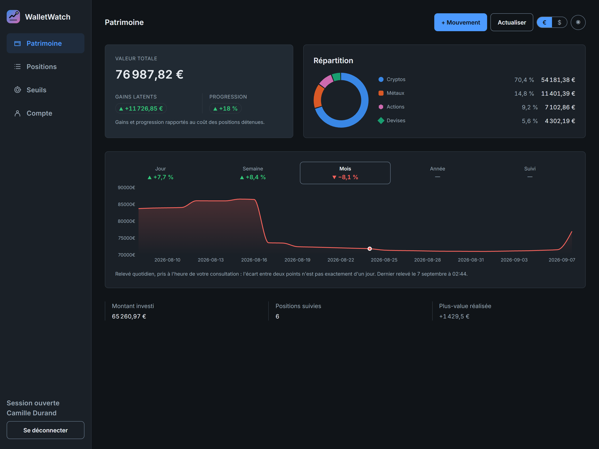
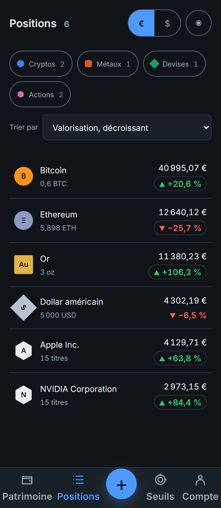
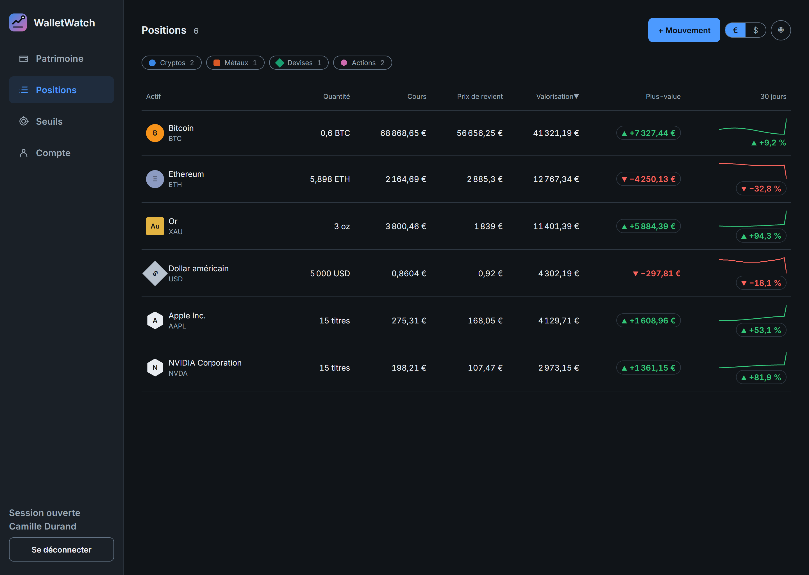

<p align="center">
  
</p>

<p align="center">
  
  
  
  
  
  
  
</p>

---

Un particulier qui répartit son épargne entre cryptomonnaies, devises étrangères, métaux
précieux et actions n'a nulle part une vue d'ensemble : chaque plateforme ne montre que sa
part. Il finit par tenir un tableur, avec des cours recopiés à la main et un prix de revient
approximatif. WalletWatch remplace ce tableur.

L'utilisateur saisit ses achats et ses ventes — quantité, prix unitaire, frais, date. Le
serveur va chercher les cours chez des fournisseurs publics, puis calcule le prix de revient
moyen pondéré de chaque position, sa plus-value latente et celle déjà encaissée. Le tout est
consolidé sur un tableau de bord conçu d'abord pour le téléphone.

> Projet réalisé seul pendant une formation, présenté au titre professionnel Développeur Web
> et Web Mobile (niveau 5). Il n'est pas destiné à un usage réel : les cours viennent de
> sources gratuites sans engagement de disponibilité et ne sont pas des données
> contractuelles. L'application ne passe aucun ordre et ne donne aucun conseil financier.

**Sommaire** — [Aperçu](#aperçu) · [Fonctionnalités](#fonctionnalités) ·
[Architecture](#architecture) · [Pile technique](#pile-technique) ·
[Démarrage](#démarrage-en-développement) · [Pile complète en conteneurs](#pile-complète-en-conteneurs) ·
[Configuration](#configuration) · [Jeux de données](#jeux-de-données) · [Tests](#tests-et-qualité) ·
[API](#interface-de-programmation) · [Partis pris](#partis-pris) · [Documentation](#documentation)

## Aperçu

| Tableau de bord, 1440 px | Positions, 375 px |
|---|---|
|  |  |



## Fonctionnalités

**Portefeuille**

- suivi d'actifs sur quatre classes : cryptomonnaie, devise, métal précieux, action ;
- enregistrement des achats, des ventes et des sorties non marchandes, avec quantité, prix
  unitaire, frais et date ;
- prix de revient moyen pondéré, frais d'achat inclus, recalculé à chaque consultation ;
- distinction entre plus-value latente, sur ce qui est encore détenu, et plus-value réalisée,
  effectivement encaissée lors d'une vente ;
- tableau de bord consolidé : valeur totale, coût de revient, répartition par classe, courbe
  d'évolution sur cinq périodes ;
- affichage au choix en euro ou en dollar, sans recalcul ni appel supplémentaire.

**Cours**

- récupération automatique auprès de six fournisseurs publics, interrogés exclusivement côté
  serveur ;
- mise en cache avec des durées de vie adaptées à chaque classe, de deux minutes pour une
  cryptomonnaie à une heure pour une devise ;
- repli sur le dernier cours connu lorsqu'un fournisseur est indisponible, affiché comme tel
  avec sa date plutôt que masqué.

**Suivi**

- seuils sur le cours d'un actif ou sur le capital total, évalués à chaque consultation ;
- historique de valorisation journalier, alimenté à la première consultation de chaque jour ;
- historique journalier du cours et de la quantité de chaque position.

**Sécurité**

- authentification par jeton signé, mots de passe hachés avec bcrypt ;
- cloisonnement des données par utilisateur inscrit dans la clause `WHERE` de chaque requête,
  jamais vérifié après coup en JavaScript ;
- révocation des sessions au changement de mot de passe, plafonnement des tentatives de
  connexion, politique de sécurité du contenu servie par Nginx.

Les annonces et l'espace d'administration restent des pistes de version 2 : le socle les
porte, aucune route ni écran ne les expose.

## Architecture

```
Navigateur (React 18 + Vite)
        |  requêtes JSON, jeton dans l'en-tête Authorization
        v
API REST (Node.js + Express)
   routes -> intergiciels -> contrôleurs -> services -> modèles
        |                          |                        |
        v                          v                        v
   PostgreSQL 16                Redis 7            Fournisseurs de cours
   données persistantes      cache des cours    Coinbase, Frankfurter, gold-api,
                                                FMP -> Finnhub -> Alpha Vantage
```

Les fournisseurs ne sont jamais appelés depuis le navigateur : une clé d'API embarquée dans
un paquet JavaScript serait lisible par quiconque ouvre les outils de développement, et le
repli sur le dernier cours connu n'aurait aucun endroit où vivre. Chacun est encapsulé dans
un adaptateur exposant la même interface, si bien que la logique métier ignore lequel a
répondu et qu'ajouter une classe d'actifs revient à écrire un adaptateur.

Détail des couches et des flux : [architecture](docs/conception/architecture.md).

## Pile technique

| Brique | Choix | Version |
|---|---|---|
| Interface | React, Vite, React Router | 18.3, Vite 8, Router 7.18 |
| Serveur | Node.js, Express | Node 20+ en local, Node 22 dans l'image ; Express 4.22 |
| Base de données | PostgreSQL | 16 |
| Cache | Redis | 7 |
| Authentification | jsonwebtoken, bcrypt | jeton HS256, validité 2 h |
| Validation | Zod | schémas déclaratifs, mode strict |
| Graphiques | Recharts | courbes d'aire et courbes miniatures |
| Tests | Vitest, Testing Library | 791 tests, un seul lanceur pour les deux moitiés |
| Analyse statique | oxlint | configuration propre à chaque moitié |
| Conteneurisation | Docker, Docker Compose | pile de développement et pile complète |
| Service des fichiers | Nginx | 1.27, image de l'interface |

## Structure du dépôt

```
backend/
  Dockerfile      image de l'API
  db/             schéma SQL, migrations, jeux de données
    docker/       script d'initialisation joué par le conteneur PostgreSQL
  src/
    adaptateurs/  fournisseurs de cours, derrière une interface commune
    cache/        client Redis résilient
    config/       chargement et contrôle de la configuration au démarrage
    controllers/  lecture de la requête, code de statut, forme de la réponse
    db/           groupe de connexions, requêtes paramétrées, transactions
    middlewares/  authentification, rôle, validation, quotas, erreurs
    models/       accès aux données, requêtes paramétrées exclusivement
    routes/       déclaration des points d'entrée
    services/     logique métier : calcul, portefeuille, cours, seuils
    utils/        arithmétique décimale exacte
    validation/   schémas d'entrée
frontend/
  Dockerfile      compilation Vite puis service par Nginx
  nginx.conf      service des fichiers, relais /api, en-têtes de sécurité
  src/
    composants/   composants d'interface et leurs feuilles de style
    pages/        un fichier par écran
    services/     point de passage unique vers l'API
    utils/        formatage, conversion d'affichage, séries
docs/             cadrage, conception, déploiement, API, conventions
fixtures/         jeu d'essai partagé par les tests du serveur et de l'interface
docker-compose.yml             développement : PostgreSQL et Redis
docker-compose.production.yml  pile complète : interface, API, PostgreSQL, Redis
```

## Démarrage en développement

La base et le cache tournent en conteneur, l'API et l'interface sur le poste, avec
rechargement à chaud. Pour tout faire tourner en conteneurs, voir la section suivante.

**Prérequis** : Node.js 20 ou supérieur, Docker et Docker Compose. Aucune installation de
PostgreSQL ni de Redis n'est nécessaire.

```bash
git clone https://github.com/geoffrey-carpentier/CapitAll.git
cd CapitAll

# 1. Configuration
cp .env.example .env                  # variables des services conteneurisés
cp backend/.env.example backend/.env  # variables de l'application
# renseigner POSTGRES_PASSWORD dans .env, puis JWT_SECRET dans backend/.env

# 2. Services de développement
docker compose up -d                  # PostgreSQL et Redis
docker compose ps                     # les deux doivent être "healthy"

# 3. Base de données
psql -h localhost -p 5432 -U capitall -d capitall -f backend/db/schema.sql
psql -h localhost -p 5432 -U capitall -d capitall -f backend/db/seed.sql

# 4. Dépendances et lancement
npm run install:all
npm run dev                           # API et interface simultanément
```

L'API répond sur `http://localhost:5000`, route de santé `/api/sante`. Vite annonce au
démarrage le port de l'interface.

Deux points qui font trébucher au premier essai. Le port 5432 est souvent déjà pris par une
installation locale de PostgreSQL : `POSTGRES_PORT` dans le `.env` de la racine permet d'en
choisir un autre, à répercuter dans `DATABASE_URL`. Et le script de création demande un rôle
propriétaire, parce qu'il installe une extension et crée le rôle applicatif à moindre
privilège dont l'API se sert ensuite.

## Pile complète en conteneurs

Interface, API, base et cache, en une commande, sans rien installer d'autre que Docker.

C'est une **pile de démonstration**, pas une mise en production : elle joue
`backend/db/seed.sql` à la création de la base, dont les identifiants figurent en clair dans
le dépôt. Un déploiement réel ne monterait pas ce script, tirerait ses secrets d'un magasin
d'exploitation et placerait un terminateur TLS devant. Tout le reste est identique.

```bash
cp .env.example .env
# renseigner POSTGRES_PASSWORD, CAPITALL_APP_PASSWORD et JWT_SECRET

docker compose -f docker-compose.production.yml up -d --build
docker compose -f docker-compose.production.yml ps   # les quatre services "healthy"
```

L'application répond sur `http://localhost:8080`. C'est le seul port publié : la base, le
cache et l'API ne sont joignables que depuis le réseau interne de la pile, et les appels du
navigateur vers `/api` sont relayés par le Nginx qui sert l'interface.

Le premier démarrage crée la base, y joue le schéma puis le jeu de démonstration. Les
suivants ne les rejouent pas, les données vivant dans un volume.

```bash
docker compose -f docker-compose.production.yml down      # arrête, conserve les données
docker compose -f docker-compose.production.yml down -v   # arrête et supprime les données
```

Les deux piles portent des noms de projet distincts et peuvent tourner en même temps :
démarrer celle-ci ne touche pas la base de développement.

Redéploiement, migrations, sauvegarde et diagnostic : [déploiement](docs/deploiement.md).

## Configuration

Deux fichiers d'environnement, aucun versionné, chacun avec son modèle commenté.

**`.env`** à la racine, consommé par Docker Compose. Les cinq premières variables valent pour
les deux piles, les suivantes ne concernent que la pile complète.

| Variable | Rôle | Défaut |
|---|---|---|
| `POSTGRES_USER` | propriétaire de la base | aucun |
| `POSTGRES_PASSWORD` | son mot de passe | aucun |
| `POSTGRES_DB` | nom de la base, à laisser à `capitall` | aucun |
| `POSTGRES_PORT` | port publié sur le poste | 5432 |
| `REDIS_PORT` | port publié sur le poste | 6379 |
| `CAPITALL_APP_PASSWORD` | mot de passe du rôle applicatif | aucun |
| `JWT_SECRET` | secret de signature des jetons | aucun |
| `JWT_EXPIRATION` | durée de validité des jetons | 2h |
| `PORT_APPLICATION` | port publié par la pile complète | 8080 |
| `ORIGINE_AUTORISEE` | origine admise par l'API | http://localhost:8080 |

**`backend/.env`**, consommé par l'API.

| Variable | Rôle | Obligatoire |
|---|---|---|
| `DATABASE_URL` | chaîne de connexion PostgreSQL | oui |
| `JWT_SECRET` | secret de signature, 32 caractères minimum | oui |
| `JWT_EXPIRATION` | durée de validité des jetons | non, 2h |
| `REDIS_URL` | adresse du cache | non |
| `PORT` | port d'écoute de l'API | non, 5000 |
| `NODE_ENV` | environnement d'exécution | non, development |
| `FMP_API_KEY` | cours d'actions, fournisseur principal | non |
| `FINNHUB_API_KEY` | cours d'actions, premier repli | non |
| `ALPHA_VANTAGE_API_KEY` | cours d'actions, second repli | non |

Les variables obligatoires sont contrôlées au démarrage : si l'une manque, le serveur
s'arrête aussitôt en listant **toutes** celles qui manquent, et non la première rencontrée.
L'absence de `REDIS_URL` n'empêche pas le démarrage, le cache étant une optimisation et non
une dépendance dure.

**Les clés de cours d'actions sont facultatives.** Sans elles, les trois autres classes
fonctionnent normalement et les actions affichent une position sans cours, signalée comme
telle. Les trois fournisseurs proposent un palier gratuit :
[FMP](https://site.financialmodelingprep.com/developer/docs),
[Finnhub](https://finnhub.io/), [Alpha Vantage](https://www.alphavantage.co/support/#api-key).
Une seule suffit pour voir le mécanisme ; les trois ensemble font fonctionner la chaîne de
repli.

## Jeux de données

Deux scripts, aux usages opposés.

**`backend/db/seed.sql`** crée trois comptes, six actifs, douze mouvements, deux seuils,
trois annonces, quatre-vingt-dix jours d'historique de valorisation et cinq cent quarante
relevés de cours, répartis dans huit tables. Il **réinitialise entièrement** la base par
`TRUNCATE ... CASCADE` avant d'insérer : déterministe et rejouable pour repartir propre, mais
destructif, donc à ne jamais appliquer à une base à préserver. Les identifiants de
démonstration figurent en tête du fichier.

**`backend/db/seed-demo.sql`** ajoute trois comptes de démonstration plus fournis — neuf
actifs, vingt-deux mouvements, six seuils, plus d'un an d'historique — **sans rien effacer**.
Il ne supprime que ses propres comptes avant de les recréer, et se termine par deux
vérifications bloquantes : aucun solde négatif à aucun instant de l'historique, et des
quantités d'instantanés cohérentes avec les mouvements. C'est celui à utiliser pour une
démonstration sur une base qui contient déjà des données.

## Tests et qualité

```bash
npm test --prefix backend               # 410 tests, sans base ni réseau
npm run test:integration --prefix backend  # 22 tests contre un vrai PostgreSQL
npm test --prefix frontend              # 359 tests d'interface
npm run lint --prefix backend
npm run lint --prefix frontend
npm run build --prefix frontend
```

Les tests portent sur ce qui contient de la logique : arithmétique décimale, moteur de
calcul, validation des entrées, intergiciels, adaptateurs de cours, stratégie de cache et
évaluation des seuils. Les services reçoivent leurs dépendances en paramètre, ce qui permet
de les exécuter sans base, sans réseau et sans cache — le même code qu'en production, avec
des modèles de substitution.

La suite d'intégration demande une base dédiée : `docker compose -f
docker-compose.test.yml up -d` la monte sur un port séparé. Elle existe parce qu'un test à
modèles simulés vérifie qu'un service **demande** un verrou, jamais que ce verrou **bloque**.

## Interface de programmation

Vingt-cinq points d'entrée, plus la route de santé.

| Domaine | Routes |
|---|---|
| Santé | `GET /api/sante` — sans authentification, interrogée par le contrôle de santé du conteneur |
| Authentification | `POST /api/auth/inscription`, `POST /api/auth/connexion`, `POST /api/auth/mot-de-passe-oublie`, `POST /api/auth/reinitialisation`, `GET /api/auth/moi` |
| Actifs | `GET POST /api/actifs`, `GET PATCH DELETE /api/actifs/:id` |
| Mouvements | `POST /api/actifs/:id/transactions`, `POST /api/actifs/:id/transactions/simulation`, `POST /api/actifs/:id/transactions/:idTransaction/simulation`, `PATCH DELETE /api/actifs/:id/transactions/:idTransaction` |
| Portefeuille | `GET /api/portefeuille`, `POST /api/portefeuille/actualisation`, `GET /api/portefeuille/historique` |
| Seuils | `GET POST /api/alertes`, `PATCH /api/alertes/:id` |
| Compte | `PATCH /api/compte/mot-de-passe`, `GET /api/compte/export-mouvements`, `DELETE /api/compte` |
| Catalogue | `GET /api/symboles` — symboles suggérés par classe, pour l'ajout d'un actif |

Toutes les routes privées attendent le jeton dans l'en-tête `Authorization: Bearer`. Une
ressource inexistante et une ressource appartenant à quelqu'un d'autre renvoient **toutes
deux un 404** : distinguer les deux confirmerait l'existence d'un identifiant.

Contrats détaillés et collection d'appels rejouable : [documentation API](docs/api/README.md).

## Partis pris

**Aucun calcul monétaire en virgule flottante.** Les montants sont stockés dans un type
numérique exact — `NUMERIC(38, 18)` pour les quantités, les prix et les cours — et manipulés
côté serveur en entiers `BigInt` à échelle fixe. Additionner deux dixièmes ne produit jamais
`0.30000000000000004`, ce qui serait inacceptable sur un prix de revient.

**Le cloisonnement est porté par le SQL.** Aucune ressource n'est chargée puis comparée en
JavaScript à l'utilisateur courant. Chaque requête filtre sur le propriétaire ; pour les
mouvements, dont la table ne porte pas d'identifiant d'utilisateur, le filtrage se fait par
jointure à l'intérieur de la même requête. Une insertion sur un actif qui n'appartient pas au
demandeur n'insère simplement rien.

**Le prix de revient n'est jamais stocké.** C'est une valeur dérivée des mouvements,
recalculée à la demande. La conserver créerait deux vérités sur le même fait, qui divergent
le jour où un mouvement ancien est corrigé.

**Les historiques, eux, sont stockés.** La valeur du portefeuille et le cours de chaque
position sont relevés au plus une fois par jour. Ils dérogent volontairement à la règle
précédente : ces faits datés ne se reconstituent pas après coup à partir des seuls
mouvements.

**Le cache n'est jamais une dépendance dure.** Redis arrêté, l'application démarre et
fonctionne, les cours étant demandés directement. Un fournisseur tombé, le dernier cours
connu est rendu, explicitement signalé comme tel avec sa date.

## Documentation

| Document | Contenu |
|---|---|
| [Note de cadrage](docs/note-de-cadrage.md) | contexte, objectifs, périmètre initial |
| [Cahier des charges](docs/cahier-des-charges.md) | acteurs, exigences, règles de gestion, critères de recette |
| [Architecture](docs/conception/architecture.md) | couches, flux, adaptateurs |
| [Modèle de données](docs/conception/modele-de-donnees.md) | modèles conceptuel, logique et physique |
| [Cas d'utilisation](docs/conception/cas-utilisation.md) | acteurs et cas d'utilisation |
| [Direction artistique](docs/conception/direction-artistique.md) | palette, typographie, écrans |
| [Jeu d'essai](docs/jeu-essai-calculs.md) | déroulé détaillé du prix de revient et des plus-values |
| [Déploiement](docs/deploiement.md) | mise en service, redéploiement, migrations, sauvegarde |
| [API](docs/api/README.md) | routes montées, contrats, collection d'appels |
| [Manuel utilisateur](docs/manuel-utilisateur.md) | parcours des sept écrans |
| [Convention de commits](docs/convention-commits.md) | format des messages et flux de contribution |

## Nom du projet

Le dépôt s'appelle `CapitAll`, le produit **WalletWatch**. Le nom définitif a été arrêté en
fin de parcours ; le dépôt, les identifiants techniques et la base gardent le nom d'origine
plutôt que de faire subir un renommage à un projet qui allait être livré.

## Licence

[MIT](LICENSE).
