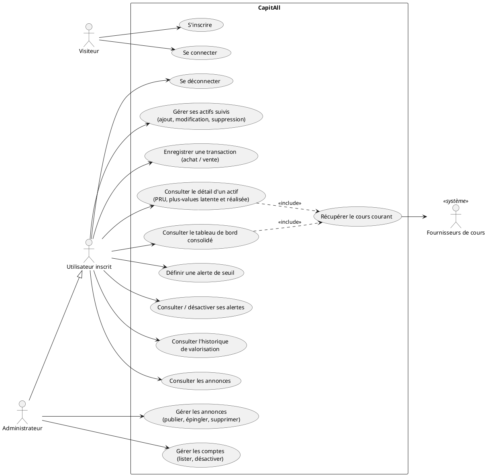

# Cas d'utilisation - CapitAll

## Acteurs

- **Visiteur** : personne non authentifiée. Ne peut que s'inscrire ou se connecter.
- **Utilisateur inscrit** : acteur principal. Gère son portefeuille et consulte ses données.
- **Administrateur** : utilisateur inscrit doté du rôle admin (D23). Hérite des capacités de l'utilisateur inscrit pour son propre portefeuille, et dispose en plus de capacités d'administration à moindre privilège : publication d'annonces, liste et désactivation de comptes, statistiques agrégées. Il n'accède jamais aux portefeuilles des autres utilisateurs.
- **Fournisseurs de cours** (acteur secondaire, système externe) : Coinbase, Frankfurter, gold-api.com, Finnhub et Alpha Vantage (actions, D20), interrogés par le serveur pour valoriser les actifs.

## Liste des cas d'utilisation

| Cas d'utilisation | Acteur | Précondition |
|---|---|---|
| S'inscrire | Visiteur | email non déjà utilisé |
| Se connecter | Visiteur | compte existant |
| Se déconnecter | Utilisateur inscrit | connecté |
| Ajouter un actif suivi | Utilisateur inscrit | connecté |
| Modifier / supprimer un actif | Utilisateur inscrit | propriétaire de l'actif |
| Enregistrer une transaction (achat ou vente) | Utilisateur inscrit | actif existant, quantité vendue disponible |
| Consulter le détail d'un actif (PRU, plus-values latente et réalisée) | Utilisateur inscrit | propriétaire de l'actif |
| Consulter le tableau de bord consolidé | Utilisateur inscrit | connecté |
| Définir une alerte de seuil (sur un actif ou sur le capital total) | Utilisateur inscrit | connecté ; propriétaire de l'actif si l'alerte cible un actif |
| Consulter / désactiver ses alertes | Utilisateur inscrit | propriétaire de l'alerte |
| Consulter l'historique de valorisation du portefeuille | Utilisateur inscrit | connecté |
| Consulter les annonces | Utilisateur inscrit | connecté |
| Publier / modifier / épingler / supprimer une annonce | Administrateur | rôle admin |
| Lister les comptes, désactiver un compte | Administrateur | rôle admin |

Le cas « consulter le détail d'un actif » et le cas « consulter le tableau de bord » incluent tous deux la récupération du cours courant auprès du fournisseur correspondant (relation d'inclusion). En cas d'indisponibilité du fournisseur, le dernier cours connu en cache est affiché avec sa date.

Le cas « consulter le tableau de bord » inclut également l'évaluation des alertes actives de l'utilisateur et l'enregistrement du snapshot de valorisation du jour s'il n'existe pas encore.

La suppression d'un actif entraîne la suppression de ses transactions et des alertes qui le ciblent ; une confirmation explicite est demandée.

## Source du diagramme (PlantUML)

Diagramme à exporter en PNG depuis plantuml.com ou l'extension VS Code PlantUML pour intégration au dossier de projet.
