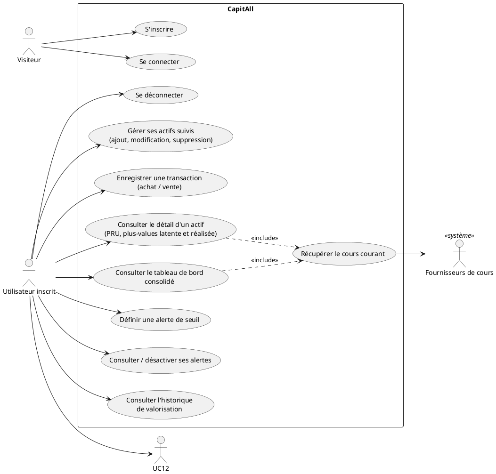

# Cas d'utilisation - WalletWatch

## Acteurs

- **Visiteur** : personne non authentifiée. Ne peut que s'inscrire ou se connecter.
- **Utilisateur inscrit** : acteur principal. Gère son portefeuille et consulte ses données.
- **Fournisseurs de cours** (acteur secondaire, système externe) : Coinbase,
  Frankfurter, gold-api.com, FMP, Finnhub et Alpha Vantage, interrogés par le
  serveur pour valoriser les actifs.

## Liste des cas d'utilisation

| Cas d'utilisation | Acteur | Précondition |
|---|---|---|
| S'inscrire | Visiteur | email non déjà utilisé |
| Se connecter | Visiteur | compte existant |
| Se déconnecter | Utilisateur inscrit | connecté |
| Ajouter un actif suivi | Utilisateur inscrit | connecté |
| Modifier / supprimer un actif | Utilisateur inscrit | propriétaire de l'actif |
| Enregistrer un mouvement (achat, vente ou sortie non marchande) | Utilisateur inscrit | actif existant, quantité sortante disponible |
| Corriger un mouvement enregistré | Utilisateur inscrit | propriétaire du mouvement ; la correction laisse valide chaque mouvement postérieur |
| Consulter le détail d'un actif (PRU, plus-values latente et réalisée) | Utilisateur inscrit | propriétaire de l'actif |
| Consulter le tableau de bord consolidé | Utilisateur inscrit | connecté |
| Définir une alerte de seuil (sur un actif ou sur le capital total) | Utilisateur inscrit | connecté ; propriétaire de l'actif si l'alerte cible un actif |
| Consulter / désactiver ses alertes | Utilisateur inscrit | propriétaire de l'alerte |
| Consulter l'historique de valorisation du portefeuille | Utilisateur inscrit | connecté |

Le cas « consulter le détail d'un actif » et le cas « consulter le tableau de bord » incluent tous deux la récupération du cours courant auprès du fournisseur correspondant (relation d'inclusion). En cas d'indisponibilité du fournisseur, le dernier cours connu en cache est affiché avec sa date.

Le cas « consulter le tableau de bord » inclut également l'évaluation des alertes actives de l'utilisateur et l'enregistrement du snapshot de valorisation du jour s'il n'existe pas encore.

La suppression d'un actif entraîne la suppression de ses transactions et des alertes qui le ciblent ; une confirmation explicite est demandée.

Le cas « corriger un mouvement » a été ajouté au périmètre en révision de D51 (voir D89). Il partage entièrement sa règle avec la suppression : aucun préfixe chronologique de la position ne peut passer sous zéro, et le refus intervient avant toute écriture. Il ne permet pas de changer l'actif du mouvement : un mouvement appartient à l'histoire d'une position, et l'en détacher laisserait celle-ci avec un prix de revient calculé sur un mouvement qu'elle n'a plus.

## Source du diagramme (PlantUML)

Diagramme à exporter en PNG depuis plantuml.com ou l'extension VS Code PlantUML pour intégration au dossier de projet.

## Gestion du compte (D64)

L'utilisateur connecté consulte les informations de son compte, change son mot de passe en fournissant l'ancien, règle la devise d'affichage et le masquage des montants, et peut supprimer son compte. La suppression exige une confirmation par mot de passe et entraîne l'effacement en cascade de ses actifs, transactions, seuils et instantanés de valorisation.

Le schéma et l'authentification savent représenter un compte inactif, mais aucun cas
d'utilisation d'administration n'est livré dans le MVP. Annonces et gestion des
comptes sont reportées en version 2 (D85).
