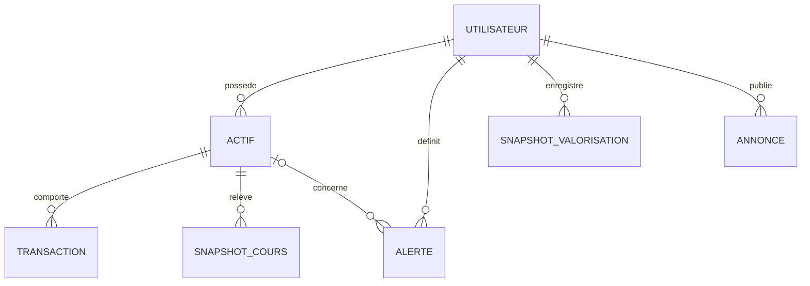
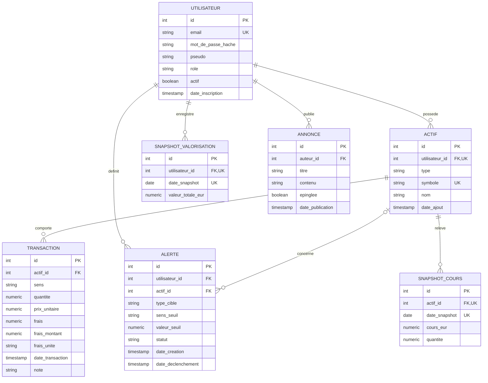

# Modèle de données - CapitAll

La conception suit les trois niveaux habituels, et ce document les tient strictement
séparés : le **MCD** dit ce que le domaine contient, le **MLD** dit comment cela se
traduit en relations, le **MPD** dit ce qui est réellement créé dans PostgreSQL. Une
information ne figure qu'au niveau qui la porte : on ne trouvera donc ni clé étrangère
au niveau conceptuel, ni type PostgreSQL au niveau logique.

Le MPD est matérialisé par `backend/db/schema.sql` et par les migrations versionnées de
`backend/db/migrations/`. Ces fichiers font foi : la section 3 en est la description, pas
une intention.

## 1. Modèle conceptuel de données (MCD)

Le schéma relationnel comporte sept entités. Six d'entre elles portent une fonctionnalité accessible du MVP ; la septième, ANNONCE, est une table préparée pour la version 2, sans aucune route ni écran dans le périmètre livré : les annonces et l'espace d'administration en sont exclus (D85). Les trois premières (utilisateur, actif, transaction) forment le socle initial. Deux entités complémentaires ont été ajoutées le 14/07/2026 (D15, D16) pour les alertes de seuil et l'historique de valorisation, puis une sixième le 16/07/2026 (D22) pour les annonces internes publiées par l'administrateur. La même date, le type d'actif `action` a été ajouté (D20, réintégration de la bourse au MVP) et la colonne `role` sur l'utilisateur (D23). Le 06/08/2026, la colonne `actif` a complété l'utilisateur (D60), le modèle ne permettant jusque-là pas de représenter la désactivation d'un compte que le rôle d'administration prévoit pourtant de déclencher. Le 23/08/2026, une septième entité a été ajoutée (D81) : l'historique de cours par position, sans lequel ni le graphe de cours de l'écran de détail ni la tendance sur trente jours du tableau des positions n'étaient alimentables. Le 05/09/2026, une huitième table est venue s'ajouter au niveau logique — les demandes de réinitialisation de mot de passe — accompagnée d'une borne de révocation sur l'utilisateur : D60 avait créé la désactivation d'un compte, mais un jeton déjà émis continuait de servir jusqu'à deux heures, et la désactivation était donc annoncée sans être appliquée.

### 1.1 Entités du domaine

| Entité | Ce qu'elle représente |
|---|---|
| UTILISATEUR | une personne titulaire d'un compte |
| ACTIF | un instrument suivi par cette personne : une cryptomonnaie, une devise, un métal, une action |
| TRANSACTION | un mouvement d'achat ou de vente portant sur un actif |
| ALERTE | un seuil de surveillance, posé sur un actif ou sur le capital total |
| SNAPSHOT_VALORISATION | la valeur du portefeuille entier, relevée un jour donné |
| SNAPSHOT_COURS | le cours d'un actif et la quantité détenue, relevés un jour donné |
| ANNONCE | un message publié par un administrateur |

`reinitialisation_mot_de_passe` ne figure pas parmi les entités du domaine : elle ne
représente rien du patrimoine suivi. C'est une table de service, portant les demandes de
réinitialisation en cours, et elle apparaît donc aux niveaux logique et physique
seulement.

Les propriétés de chaque entité ne sont pas listées ici : elles appartiennent au niveau
logique et figurent en section 2. Le niveau conceptuel retenu ne porte que les entités,
leurs associations et leurs cardinalités — c'est un choix de lisibilité, qui évite de
répéter au conceptuel ce que le logique décrit déjà.

ANNONCE figure au modèle parce que la table existe au schéma, et pour cette seule raison.
Aucun parcours du MVP ne l'atteint.

### 1.2 Diagramme conceptuel



### 1.3 Associations et cardinalités

```
UTILISATEUR (0,n) --- POSSÉDER ------ (1,1) ACTIF
ACTIF       (0,n) --- COMPORTER ----- (1,1) TRANSACTION
UTILISATEUR (0,n) --- DEFINIR ------- (1,1) ALERTE
ACTIF       (0,n) --- CONCERNER ----- (0,1) ALERTE
UTILISATEUR (0,n) --- ENREGISTRER --- (1,1) SNAPSHOT_VALORISATION
ACTIF       (0,n) --- RELEVER ------- (1,1) SNAPSHOT_COURS
UTILISATEUR (0,n) --- PUBLIER ------- (1,1) ANNONCE
```

Lecture : un compte neuf peut ne posséder encore aucun actif. Un actif peut exister sans
mouvement, notamment si la feuille est abandonnée après sa création. De même, alertes
et snapshots sont facultatifs tant que leurs déclencheurs n'ont pas été utilisés. Toute
entité enfant appartient en revanche à exactement un parent. La table `annonce` reste
préparée pour une version 2 ; aucune route de publication n'est montée dans le MVP.

### 1.4 Choix de conception discutés


- Le cours courant n'est pas une entité : il est volatil, fourni par les API externes à la demande, et le persister n'apporte rien au MVP. Sa volatilité est en revanche traitée par un cache technique (Redis, hors du modèle relationnel, voir architecture.md et D14), pas par une entité SQL.
- Le PRU et la plus-value ne sont pas stockés : ce sont des valeurs calculées à partir des transactions, les stocker créerait un risque d'incohérence (D8).
- Un référentiel d'actifs partagé entre utilisateurs (table de symboles commune) a été envisagé puis écarté : il complexifie le modèle sans bénéfice au MVP, chaque utilisateur déclare simplement les symboles qu'il suit (D9).
- SNAPSHOT_VALORISATION déroge en apparence à la règle « pas de valeur dérivée stockée » : la dérogation est volontaire (D16). Une valeur de portefeuille à une date passée n'est pas recalculable après coup dès lors que les cours historiques des fournisseurs ne sont pas conservés côté CapitAll ; un snapshot est donc un fait historique à part entière, pas une donnée redondante avec les transactions. Il sert aussi à éviter de rappeler les API de cours pour reconstituer une courbe d'évolution.
- SNAPSHOT_COURS déroge à la même règle et pour la même raison que SNAPSHOT_VALORISATION (D81). Un cours passé ne se recalcule pas : les fournisseurs ne conservent pas leur historique de la même façon selon la classe d'actif, et l'un d'eux n'en expose aucun. Ce que l'application n'a pas relevé le jour même est perdu, ce qui fait de chaque ligne un fait daté. La quantité détenue y est jointe au cours, faute de quoi reconstituer la valeur passée d'une position obligerait à rejouer toutes ses transactions antérieures à chaque point de la courbe.
- SNAPSHOT_COURS ne porte pas d'`utilisateur_id`, alors que SNAPSHOT_VALORISATION en porte un. La différence n'est pas une inconséquence : un snapshot de valorisation porte sur le portefeuille entier, dont l'utilisateur est la seule clé possible, tandis qu'un relevé de cours porte sur un actif, qui connaît déjà son propriétaire. Dupliquer l'information créerait une seconde vérité sur le cloisonnement, avec la certitude qu'elles divergent un jour ; le cloisonnement se lit donc par jointure, comme pour TRANSACTION.
- ALERTE ne référence pas systématiquement un actif : `actif_id` est nul lorsque l'alerte porte sur le capital total du portefeuille plutôt que sur un actif précis. Contrairement à la règle « quantité vendue disponible » qui nécessite une agrégation sur plusieurs lignes de transaction et reste donc du ressort du serveur, la cohérence entre `type_cible` et la présence de `actif_id` ne porte que sur des colonnes de la même ligne : elle est directement portée par une contrainte CHECK au niveau du MPD.

## 2. Modèle logique de données (MLD)

### 2.1 Notation relationnelle

Clés primaires préfixées par `#`, clés étrangères par `->` :

```
utilisateur (#id, email UNIQUE NOT NULL, mot_de_passe_hache NOT NULL,
             pseudo NOT NULL, role NOT NULL DEFAULT 'utilisateur',
             actif NOT NULL DEFAULT true, jetons_invalides_avant, date_inscription NOT NULL)

reinitialisation_mot_de_passe (#id, ->utilisateur_id NOT NULL, jeton_hache NOT NULL UNIQUE,
    date_creation NOT NULL, expire_le NOT NULL, utilise_le)

actif (#id, ->utilisateur_id NOT NULL, type NOT NULL, symbole NOT NULL,
       nom NOT NULL, date_ajout NOT NULL,
       UNIQUE(utilisateur_id, symbole))

transaction (#id, ->actif_id NOT NULL, sens NOT NULL, quantite NOT NULL,
             prix_unitaire NOT NULL, frais NOT NULL DEFAULT 0,
             frais_montant NOT NULL DEFAULT 0, frais_unite NOT NULL DEFAULT 'EUR',
             date_transaction NOT NULL, note)

alerte (#id, ->utilisateur_id NOT NULL, ->actif_id NULL, type_cible NOT NULL,
        sens_seuil NOT NULL, valeur_seuil NOT NULL, statut NOT NULL DEFAULT 'active',
        date_creation NOT NULL, date_declenchement)

snapshot_valorisation (#id, ->utilisateur_id NOT NULL, date_snapshot NOT NULL,
                        valeur_totale_eur NOT NULL,
                        UNIQUE(utilisateur_id, date_snapshot))

snapshot_cours (#id, ->actif_id NOT NULL, date_snapshot NOT NULL,
                cours_eur NOT NULL, quantite NOT NULL,
                UNIQUE(actif_id, date_snapshot))

annonce (#id, ->auteur_id NOT NULL, titre NOT NULL, contenu NOT NULL,
         epinglee NOT NULL DEFAULT false, date_publication NOT NULL)
```

### 2.2 Contraintes de domaine, à porter au niveau physique


- `type` restreint à ('crypto', 'devise', 'metal', 'action') par contrainte CHECK
- `role` restreint à ('utilisateur', 'admin') par contrainte CHECK, défaut 'utilisateur'
- `actif` booléen non nul, défaut `true` : un compte est utilisable dès sa création
- `sens` restreint à ('achat', 'vente', 'sortie_non_marchande') par contrainte CHECK
- `type_cible` restreint à ('actif', 'capital_total') par contrainte CHECK
- `sens_seuil` restreint à ('au_dessus', 'en_dessous') par contrainte CHECK
- `statut` de l'alerte restreint à ('active', 'declenchee', 'desactivee') par contrainte CHECK
- `quantite > 0`, `prix_unitaire >= 0`, `frais >= 0`, `frais_montant >= 0`, `valeur_seuil > 0`, `valeur_totale_eur >= 0`
- sur `transaction`, deux contraintes croisées (D89) : `frais_unite <> 'EUR' OR frais_montant = frais`, qui interdit aux deux colonnes de frais de diverger quand l'unité prélevée est l'euro ; et `sens <> 'sortie_non_marchande' OR prix_unitaire = 0`, qui interdit à un transfert de porter un prix — c'est ce prix qui le ferait lire comme une vente
- sur `snapshot_cours` : `cours_eur >= 0` et `quantite >= 0`, la quantité pouvant valoir zéro avant le premier achat de l'actif
- montants et quantités en `NUMERIC` (pas de flottant sur des valeurs financières)
- suppression en cascade des transactions à la suppression d'un actif (`ON DELETE CASCADE`), suppression d'un utilisateur en cascade sur ses actifs, ses alertes, ses snapshots et ses annonces
- suppression d'un actif en cascade sur les alertes qui le ciblent et sur ses relevés de cours (`ON DELETE CASCADE` sur alerte.actif_id et snapshot_cours.actif_id) ; la suppression d'un compte atteint donc ces relevés en deux sauts, par ses actifs
- la règle « quantité vendue disponible » (on ne vend pas plus que ce que l'on détient) porte sur l'agrégation de plusieurs transactions : elle est vérifiée côté serveur, pas par une contrainte SQL
- la cohérence entre `type_cible` et la présence de `actif_id` (actif_id renseigné si et seulement si type_cible = 'actif') ne porte que sur la même ligne : elle est portée par une contrainte CHECK au niveau du MPD

### 2.3 Diagramme logique

Ce diagramme est le pendant graphique de la notation ci-dessus : il porte les attributs,
les clés primaires (`PK`), les clés étrangères (`FK`) et les unicités (`UK`). Une unicité
marquée sur deux colonnes d'une même table est composée, et non deux unicités séparées :
c'est le cas de `actif`, `snapshot_valorisation` et `snapshot_cours`. Les types y restent
génériques ; leur forme exacte relève du niveau physique, en section 3.




## 3. Modèle physique de données (MPD, PostgreSQL 16)

Description de ce que `backend/db/schema.sql` crée réellement, colonne par colonne. Toute
valeur de cette section est relevée dans ce fichier et dans les migrations de
`backend/db/migrations/` ; aucune contrainte n'y est ajoutée par anticipation.

Convention de lecture : `SERIAL` est le raccourci PostgreSQL de `integer NOT NULL DEFAULT
nextval(...)` avec sa séquence dédiée, et fournit la clé primaire de chacune des sept
tables. Une colonne marquée « non » en nullabilité porte `NOT NULL` dans le script.

### 3.1 `utilisateur`

| Colonne | Type | Nul | Défaut | Contraintes |
|---|---|---|---|---|
| `id` | `SERIAL` | non | séquence | `PRIMARY KEY` |
| `email` | `VARCHAR(255)` | non | — | `UNIQUE` |
| `mot_de_passe_hache` | `VARCHAR(255)` | non | — | — |
| `pseudo` | `VARCHAR(100)` | non | — | — |
| `role` | `VARCHAR(20)` | non | `'utilisateur'` | `CHECK (role IN ('utilisateur','admin'))` |
| `actif` | `BOOLEAN` | non | `true` | — |
| `date_inscription` | `TIMESTAMPTZ` | non | `now()` | — |

### 3.2 `actif`

| Colonne | Type | Nul | Défaut | Contraintes |
|---|---|---|---|---|
| `id` | `SERIAL` | non | séquence | `PRIMARY KEY` |
| `utilisateur_id` | `INTEGER` | non | — | `REFERENCES utilisateur(id) ON DELETE CASCADE` |
| `type` | `VARCHAR(20)` | non | — | `CHECK (type IN ('crypto','devise','metal','action'))` |
| `symbole` | `VARCHAR(20)` | non | — | — |
| `nom` | `VARCHAR(100)` | non | — | — |
| `date_ajout` | `TIMESTAMPTZ` | non | `now()` | — |

Contrainte de table : `UNIQUE (utilisateur_id, symbole)`.

### 3.3 `transaction`

| Colonne | Type | Nul | Défaut | Contraintes |
|---|---|---|---|---|
| `id` | `SERIAL` | non | séquence | `PRIMARY KEY` |
| `actif_id` | `INTEGER` | non | — | `REFERENCES actif(id) ON DELETE CASCADE` |
| `sens` | `VARCHAR(25)` | non | — | `CHECK (sens IN ('achat','vente','sortie_non_marchande'))` |
| `quantite` | `NUMERIC(38,18)` | non | — | `CHECK (quantite > 0)` |
| `prix_unitaire` | `NUMERIC(38, 18)` | non | — | `CHECK (prix_unitaire >= 0)` |
| `frais` | `NUMERIC(18,2)` | non | `0` | `CHECK (frais >= 0)` |
| `frais_montant` | `NUMERIC(38,18)` | non | `0` | `CHECK (frais_montant >= 0)` |
| `frais_unite` | `VARCHAR(20)` | non | `'EUR'` | contrainte croisée avec `frais` |
| `date_transaction` | `TIMESTAMPTZ` | non | — | — |
| `note` | `TEXT` | **oui** | — | — |

Aucune colonne `utilisateur_id` : le propriétaire se lit par jointure sur `actif`.

**Trois colonnes pour les frais, et une seule consommée par le calcul.** Une plateforme
de cryptomonnaies ne prélève pas des euros : elle retient une fraction de l'actif
échangé. `frais` porte la contre-valeur en euros au moment de l'opération, et c'est elle
seule qui entre dans le prix de revient ; `frais_montant` et `frais_unite` conservent ce
qui a réellement été retenu. Convertir à la saisie et ne garder que le résultat laissait
le calcul exact mais rendait le fait indisponible : rien ne permettait plus de dire
combien avait été prélevé, ni en quoi.

La contre-valeur n'est jamais devinée. En euros, les deux colonnes coïncident, ce que la
contrainte impose. Dans l'actif de l'opération, le taux est le prix de cette opération,
puisque c'est à ce prix que la plateforme a retenu sa part. Dans un tiers actif, aucun
taux ne se lit dans le mouvement : l'utilisateur donne la contre-valeur, et le serveur
refuse la saisie sans elle.

**La quantité est toujours la quantité réelle** entrée ou sortie de la position, jamais
une quantité brute dont les frais seraient à déduire. C'est ce qui écarte le double
comptage : les frais retenus en nature ont déjà réduit la quantité reçue, et la
contre-valeur reconstitue la part payée en plus, jamais deux fois.

**Une troisième nature de mouvement.** `sortie_non_marchande` couvre le transfert et le
retrait : la quantité quitte la position sans contrepartie en euros. Le coût restant
valant prix de revient multiplié par quantité, le décrément réduit ce coût exactement au
prorata et laisse le prix de revient unitaire intact — le réduire davantage le ferait
mécaniquement monter, ce qui serait faux. La valeur perdue est portée par un résultat
distinct de la plus-value réalisée, qui se constate lors d'une vente.

Ce mouvement est une valeur du `sens` et non une colonne de plus. Une seconde colonne
« nature » à côté du sens autoriserait des combinaisons contradictoires qu'il faudrait
ensuite interdire par contrainte, pour ne décrire qu'une seule chose.

### 3.4 `alerte`

| Colonne | Type | Nul | Défaut | Contraintes |
|---|---|---|---|---|
| `id` | `SERIAL` | non | séquence | `PRIMARY KEY` |
| `utilisateur_id` | `INTEGER` | non | — | `REFERENCES utilisateur(id) ON DELETE CASCADE` |
| `actif_id` | `INTEGER` | **oui** | — | `REFERENCES actif(id) ON DELETE CASCADE` |
| `type_cible` | `VARCHAR(20)` | non | — | `CHECK (type_cible IN ('actif','capital_total'))` |
| `sens_seuil` | `VARCHAR(20)` | non | — | `CHECK (sens_seuil IN ('au_dessus','en_dessous'))` |
| `valeur_seuil` | `NUMERIC(38, 18)` | non | — | `CHECK (valeur_seuil > 0)` |
| `statut` | `VARCHAR(20)` | non | `'active'` | `CHECK (statut IN ('active','declenchee','desactivee'))` |
| `date_creation` | `TIMESTAMPTZ` | non | `now()` | — |
| `date_declenchement` | `TIMESTAMPTZ` | **oui** | — | — |

Contrainte de table, croisée sur deux colonnes de la même ligne :

```sql
CHECK (
    (type_cible = 'actif'         AND actif_id IS NOT NULL) OR
    (type_cible = 'capital_total' AND actif_id IS NULL)
)
```

### 3.5 `snapshot_valorisation`

| Colonne | Type | Nul | Défaut | Contraintes |
|---|---|---|---|---|
| `id` | `SERIAL` | non | séquence | `PRIMARY KEY` |
| `utilisateur_id` | `INTEGER` | non | — | `REFERENCES utilisateur(id) ON DELETE CASCADE` |
| `date_snapshot` | `DATE` | non | — | — |
| `valeur_totale_eur` | `NUMERIC(30, 2)` | non | — | `CHECK (valeur_totale_eur >= 0)` |

Contrainte de table : `UNIQUE (utilisateur_id, date_snapshot)`. C'est elle qui rend
l'écriture quotidienne idempotente.

### 3.6 `snapshot_cours`

| Colonne | Type | Nul | Défaut | Contraintes |
|---|---|---|---|---|
| `id` | `SERIAL` | non | séquence | `PRIMARY KEY` |
| `actif_id` | `INTEGER` | non | — | `REFERENCES actif(id) ON DELETE CASCADE` |
| `date_snapshot` | `DATE` | non | — | — |
| `cours_eur` | `NUMERIC(38, 18)` | non | — | `CHECK (cours_eur >= 0)` |
| `quantite` | `NUMERIC(38,18)` | non | — | `CHECK (quantite >= 0)` |

Contrainte de table : `UNIQUE (actif_id, date_snapshot)`. Table ajoutée par la migration
`2026-08-23_historique-cours-par-position.sql`, qui accorde aussi ses droits au rôle
applicatif : ce rôle est créé par `schema.sql` avant l'existence de la table, une base
déjà en service ne les hérite donc pas.

### 3.7 `annonce`

| Colonne | Type | Nul | Défaut | Contraintes |
|---|---|---|---|---|
| `id` | `SERIAL` | non | séquence | `PRIMARY KEY` |
| `auteur_id` | `INTEGER` | non | — | `REFERENCES utilisateur(id) ON DELETE CASCADE` |
| `titre` | `VARCHAR(200)` | non | — | — |
| `contenu` | `TEXT` | non | — | — |
| `epinglee` | `BOOLEAN` | non | `false` | — |
| `date_publication` | `TIMESTAMPTZ` | non | `now()` | — |

Table présente au schéma, sans aucune route montée : les annonces sont reportées en
version 2 (D85).

### 3.8 Index créés

Outre les index que PostgreSQL crée seul pour chaque clé primaire et chaque contrainte
d'unicité, six index explicites figurent au script :

| Index | Portée |
|---|---|
| `idx_actif_utilisateur` | `actif(utilisateur_id)` |
| `idx_transaction_actif` | `transaction(actif_id)` |
| `idx_transaction_date` | `transaction(date_transaction)` |
| `idx_alerte_utilisateur` | `alerte(utilisateur_id)` |
| `idx_alerte_actif` | `alerte(actif_id)`, **partiel** : `WHERE actif_id IS NOT NULL` |
| `idx_annonce_date` | `annonce(date_publication DESC)` |

Les deux tables d'instantanés n'en portent aucun de plus : leur contrainte d'unicité
produit déjà un index sur (propriétaire, date) dans cet ordre, qui est exactement la
lecture faite par l'application — une cible filtrée, puis triée par date.

### 3.9 Chaînes de suppression

`ON DELETE CASCADE` est posé sur les sept clés étrangères du schéma. La suppression d'un compte
atteint donc, en un saut, ses actifs, ses alertes, ses instantanés de valorisation et ses
annonces ; et en deux sauts, par ses actifs, ses transactions, ses relevés de cours et les
alertes qui ciblent l'un de ces actifs.

### 3.10 Rôle applicatif

`schema.sql` crée le rôle `capitall_app` s'il n'existe pas, et lui accorde `CONNECT`,
`USAGE` sur le schéma, `SELECT, INSERT, UPDATE, DELETE` sur les tables et `USAGE, SELECT`
sur les séquences. Il ne reçoit aucun droit de création : l'application ne se connecte
jamais avec le propriétaire de la base. Le mot de passe inscrit au script est une valeur
de développement, remplacée à l'initialisation par une variable d'environnement.

### 3.11 Ce que le niveau physique ne porte pas

La règle « on ne vend pas plus que ce que l'on détient » n'apparaît nulle part ci-dessus,
et c'est volontaire : elle porte sur la somme de plusieurs lignes de `transaction`, à
chaque étape de leur ordre chronologique. Aucune contrainte `CHECK`, qui ne voit qu'une
ligne, ne peut l'exprimer. Elle est vérifiée côté serveur, dans une transaction SQL avec
verrou sur l'actif, à la création comme à la suppression d'un mouvement.

À l'inverse, la cohérence entre `type_cible` et `actif_id` ne porte que sur deux colonnes
d'une même ligne : elle est donc portée par la base, en section 3.4. La frontière entre ce
que le modèle relationnel garantit et ce qui relève du code passe exactement là.

## 4. Accès et révocation

### 4.1 `utilisateur.jetons_invalides_avant`

| Colonne | Type | Nul | Défaut |
|---|---|---|---|
| `jetons_invalides_avant` | `TIMESTAMPTZ` | **oui** | — |

Tout jeton émis avant cet instant est refusé, quelle que soit sa date d'expiration. La
borne est posée au changement de mot de passe et à la réinitialisation, et peut l'être à
la main pour couper l'accès d'un compte compromis.

Une borne plutôt qu'une liste de jetons révoqués : un jeton porte sa date d'émission, il
suffit de la comparer. Une table de jetons aurait imposé d'y écrire à chaque déconnexion
et de la purger ensuite, pour la même garantie.

La comparaison se fait à la seconde, `iat` n'ayant pas plus de précision, et un jeton émis
dans la même seconde que la borne est **accepté**. Arrondir dans l'autre sens refuserait le
jeton neuf remis par le changement de mot de passe, et déconnecterait l'utilisateur de
l'opération qu'il vient de réussir. Le prix est une fenêtre d'une seconde pendant laquelle
un jeton antérieur survit.

### 4.2 `reinitialisation_mot_de_passe`

| Colonne | Type | Nul | Défaut | Contraintes |
|---|---|---|---|---|
| `id` | `SERIAL` | non | séquence | `PRIMARY KEY` |
| `utilisateur_id` | `INTEGER` | non | — | `REFERENCES utilisateur(id) ON DELETE CASCADE` |
| `jeton_hache` | `CHAR(64)` | non | — | `UNIQUE` |
| `date_creation` | `TIMESTAMPTZ` | non | `now()` | — |
| `expire_le` | `TIMESTAMPTZ` | non | — | — |
| `utilise_le` | `TIMESTAMPTZ` | **oui** | — | — |

Le jeton remis à l'utilisateur n'est pas conservé : seule son empreinte l'est. Une base lue
par un tiers ne donne alors aucun moyen de prendre la main sur un compte.

SHA-256 et non bcrypt, à la différence d'un mot de passe : le jeton fait trente-deux octets
tirés au hasard et n'est pas devinable par force brute. Le coût de bcrypt protège les
secrets à faible entropie ; il n'aurait ici aucun objet, et rendrait la recherche par
empreinte impossible.

`utilise_le` porte l'unicité d'usage. La condition est appliquée dans la requête de mise à
jour et non après une lecture : deux appels simultanés avec le même jeton ne peuvent alors
pas réussir tous les deux, le second ne trouvant plus de ligne à marquer. Émettre une
nouvelle demande marque au passage les précédentes du compte, de sorte qu'une seule clé
soit en circulation à la fois.
