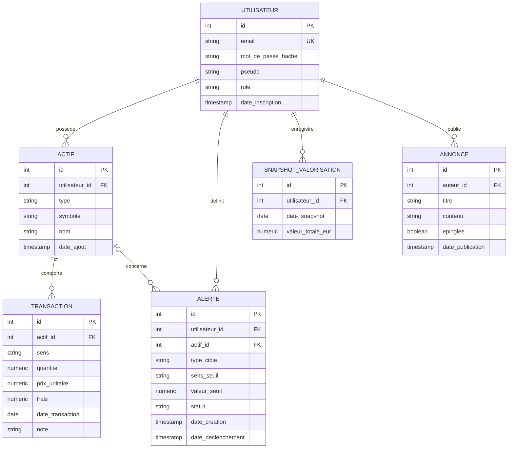

# Modèle de données - CapitAll

## Modèle conceptuel de données (MCD, formalisme Merise)

Six entités couvrent le périmètre du MVP. Les trois premières (utilisateur, actif, transaction) forment le socle initial. Deux entités complémentaires ont été ajoutées le 14/07/2026 (D15, D16) pour les alertes de seuil et l'historique de valorisation, puis une sixième le 16/07/2026 (D22) pour les annonces internes publiées par l'administrateur. La même date, le type d'actif `action` a été ajouté (D20, réintégration de la bourse au MVP) et la colonne `role` sur l'utilisateur (D23).

### Entités

**UTILISATEUR**
- id_utilisateur (identifiant)
- email
- mot_de_passe (haché, jamais stocké en clair)
- pseudo
- role (utilisateur / admin)
- date_inscription

**ACTIF**
- id_actif (identifiant)
- type (crypto / devise / metal / action)
- symbole (ex. BTC, USD, XAU, AAPL)
- nom (ex. Bitcoin, Dollar américain, Or, Apple)
- date_ajout

**TRANSACTION**
- id_transaction (identifiant)
- sens (achat / vente)
- quantite
- prix_unitaire (en euros, devise de référence du MVP)
- frais
- date_transaction
- note

**ALERTE**
- id_alerte (identifiant)
- type_cible (actif / capital_total)
- sens_seuil (au-dessus / en-dessous)
- valeur_seuil
- statut (active / declenchee / desactivee)
- date_creation
- date_declenchement (renseignée seulement au déclenchement)

**SNAPSHOT_VALORISATION**
- id_snapshot (identifiant)
- date_snapshot
- valeur_totale_eur

**ANNONCE**
- id_annonce (identifiant)
- titre
- contenu
- epinglee (oui / non)
- date_publication

### Associations et cardinalités

```
UTILISATEUR (1,n) --- POSSÉDER ------ (1,1) ACTIF
ACTIF       (1,n) --- COMPORTER ----- (1,1) TRANSACTION
UTILISATEUR (1,n) --- DEFINIR ------- (1,1) ALERTE
ACTIF       (0,n) --- CONCERNER ----- (0,1) ALERTE
UTILISATEUR (1,n) --- ENREGISTRER --- (1,1) SNAPSHOT_VALORISATION
UTILISATEUR (0,n) --- PUBLIER ------- (1,1) ANNONCE
```

Lecture : un utilisateur possède un ou plusieurs actifs suivis ; un actif appartient à un et un seul utilisateur. Un actif comporte une ou plusieurs transactions ; une transaction porte sur un et un seul actif. Un utilisateur définit une ou plusieurs alertes ; une alerte appartient à un et un seul utilisateur. Une alerte concerne éventuellement un actif précis (type_cible = actif) ou aucun (type_cible = capital_total, portant alors sur l'ensemble du portefeuille) ; un actif peut être la cible de zéro, une ou plusieurs alertes. Un utilisateur enregistre un ou plusieurs snapshots de valorisation ; un snapshot appartient à un et un seul utilisateur. Un utilisateur publie zéro ou plusieurs annonces ; une annonce est publiée par un et un seul utilisateur, la restriction « seul un admin publie » étant une règle de gestion portée par le rôle, vérifiée côté serveur, pas par la structure du modèle.

Choix de conception discutés :

- Le cours courant n'est pas une entité : il est volatil, fourni par les API externes à la demande, et le persister n'apporte rien au MVP. Sa volatilité est en revanche traitée par un cache technique (Redis, hors du modèle relationnel, voir architecture.md et D14), pas par une entité SQL.
- Le PRU et la plus-value ne sont pas stockés : ce sont des valeurs calculées à partir des transactions, les stocker créerait un risque d'incohérence (D8).
- Un référentiel d'actifs partagé entre utilisateurs (table de symboles commune) a été envisagé puis écarté : il complexifie le modèle sans bénéfice au MVP, chaque utilisateur déclare simplement les symboles qu'il suit (D9).
- SNAPSHOT_VALORISATION déroge en apparence à la règle « pas de valeur dérivée stockée » : la dérogation est volontaire (D16). Une valeur de portefeuille à une date passée n'est pas recalculable après coup dès lors que les cours historiques des fournisseurs ne sont pas conservés côté CapitAll ; un snapshot est donc un fait historique à part entière, pas une donnée redondante avec les transactions. Il sert aussi à éviter de rappeler les API de cours pour reconstituer une courbe d'évolution.
- ALERTE ne référence pas systématiquement un actif : `actif_id` est nul lorsque l'alerte porte sur le capital total du portefeuille plutôt que sur un actif précis. Contrairement à la règle « quantité vendue disponible » qui nécessite une agrégation sur plusieurs lignes de transaction et reste donc du ressort du serveur, la cohérence entre `type_cible` et la présence de `actif_id` ne porte que sur des colonnes de la même ligne : elle est directement portée par une contrainte CHECK au niveau du MPD.

## Modèle logique de données (MLD)

Notation relationnelle, clés primaires soulignées par convention # , clés étrangères préfixées par -> :

```
utilisateur (#id, email UNIQUE NOT NULL, mot_de_passe_hache NOT NULL,
             pseudo NOT NULL, role NOT NULL DEFAULT 'utilisateur',
             date_inscription NOT NULL)

actif (#id, ->utilisateur_id NOT NULL, type NOT NULL, symbole NOT NULL,
       nom NOT NULL, date_ajout NOT NULL,
       UNIQUE(utilisateur_id, symbole))

transaction (#id, ->actif_id NOT NULL, sens NOT NULL, quantite NOT NULL,
             prix_unitaire NOT NULL, frais NOT NULL DEFAULT 0,
             date_transaction NOT NULL, note)

alerte (#id, ->utilisateur_id NOT NULL, ->actif_id NULL, type_cible NOT NULL,
        sens_seuil NOT NULL, valeur_seuil NOT NULL, statut NOT NULL DEFAULT 'active',
        date_creation NOT NULL, date_declenchement)

snapshot_valorisation (#id, ->utilisateur_id NOT NULL, date_snapshot NOT NULL,
                        valeur_totale_eur NOT NULL,
                        UNIQUE(utilisateur_id, date_snapshot))

annonce (#id, ->auteur_id NOT NULL, titre NOT NULL, contenu NOT NULL,
         epinglee NOT NULL DEFAULT false, date_publication NOT NULL)
```

Contraintes de domaine prévues pour le MPD (PostgreSQL) :

- `type` restreint à ('crypto', 'devise', 'metal', 'action') par contrainte CHECK
- `role` restreint à ('utilisateur', 'admin') par contrainte CHECK, défaut 'utilisateur'
- `sens` restreint à ('achat', 'vente') par contrainte CHECK
- `type_cible` restreint à ('actif', 'capital_total') par contrainte CHECK
- `sens_seuil` restreint à ('au_dessus', 'en_dessous') par contrainte CHECK
- `statut` de l'alerte restreint à ('active', 'declenchee', 'desactivee') par contrainte CHECK
- `quantite > 0`, `prix_unitaire >= 0`, `frais >= 0`, `valeur_seuil > 0`, `valeur_totale_eur >= 0`
- montants et quantités en `NUMERIC` (pas de flottant sur des valeurs financières)
- suppression en cascade des transactions à la suppression d'un actif (`ON DELETE CASCADE`), suppression d'un utilisateur en cascade sur ses actifs, ses alertes, ses snapshots et ses annonces
- suppression d'un actif en cascade sur les alertes qui le ciblent (`ON DELETE CASCADE` sur alerte.actif_id)
- la règle « quantité vendue disponible » (on ne vend pas plus que ce que l'on détient) porte sur l'agrégation de plusieurs transactions : elle est vérifiée côté serveur, pas par une contrainte SQL
- la cohérence entre `type_cible` et la présence de `actif_id` (actif_id renseigné si et seulement si type_cible = 'actif') ne porte que sur la même ligne : elle est portée par une contrainte CHECK au niveau du MPD

Le MPD (script SQL complet avec index) sera produit en phase back-end, il découle directement de ce MLD.

## Diagramme entité-association (source Mermaid)


